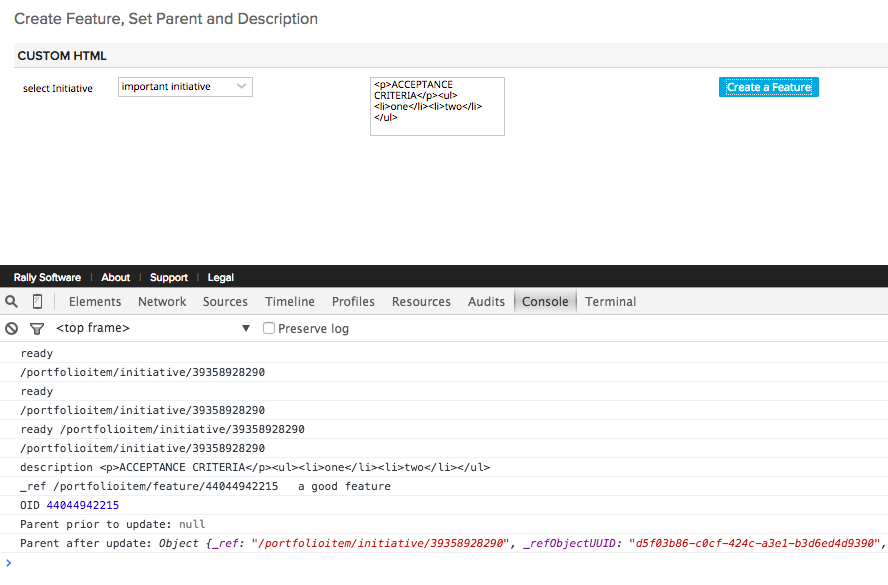
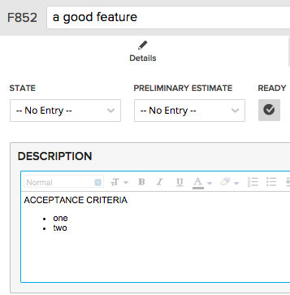

Create Feature, set Parent and Description
=========================

## Overview

Select Initiative and leave or modify default Description in the text area and click to create a new Feature:

New Feature is created:

This app example is available AS IS. It is NOT supported by Rally.

## License

AppTemplate is released under the MIT license.  See the file [LICENSE](./LICENSE) for the full text.

##Documentation for SDK

You can find the documentation on our help [site.](https://help.rallydev.com/apps/2.0/doc/)
