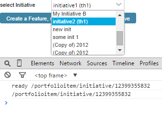

Create Feature,set Parent
=========================

## Overview

Note about the AppSDK version: the app is written with AppSDK2rc2. The combobox did not expand when AppSDK2rc3 is used.
This app example is vailable AS IS. It is NOT supported by Rally.

## License

AppTemplate is released under the MIT license.  See the file [LICENSE](./LICENSE) for the full text.

##Documentation for SDK

You can find the documentation on our help [site.](https://help.rallydev.com/apps/2.0rc3/doc/)
